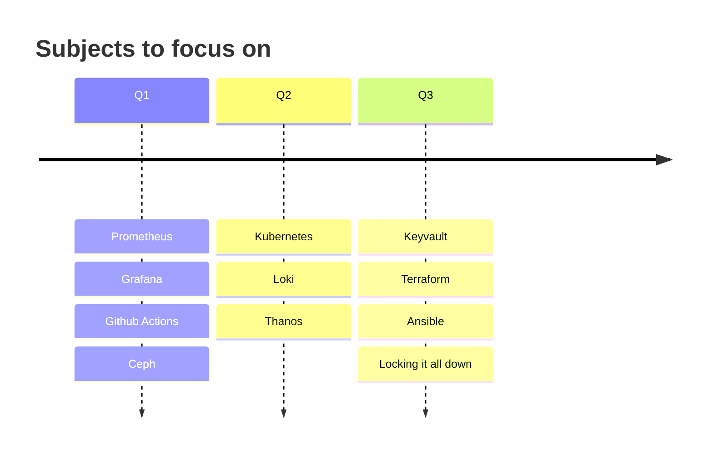

# Lab Roadmap
As mentioned in the main page, this lab is really a safe space for me to learn, play, experiment. 

However, there are some core technologies that I'm focussed on learning. Currently the lab is to help me learn Prometheus, Grafana, and other observability tools in-depth while maintaining minimal viable knowledge of Proxmox, Kubernetes, docker etc. Over time I will focus on and expand my knowledge in other areas. Below is a rough roadmap, and an excuse to play around with [Mermaid diagrams](https://mermaid.js.org/). 

